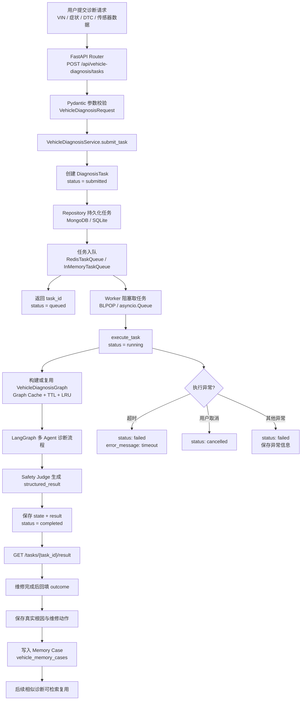
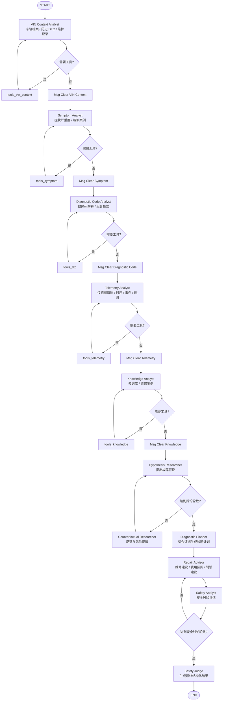
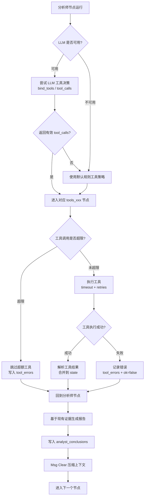
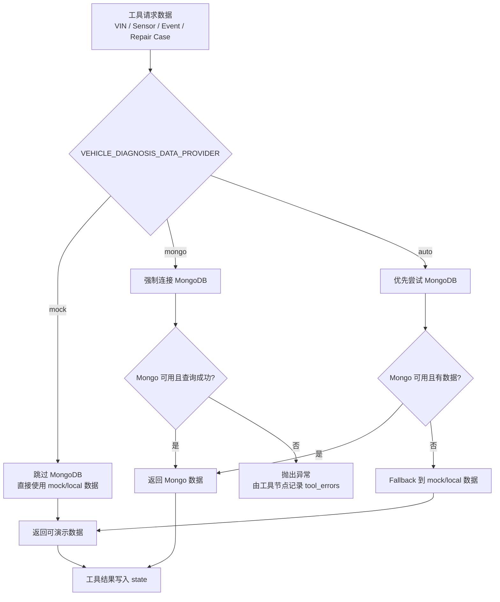
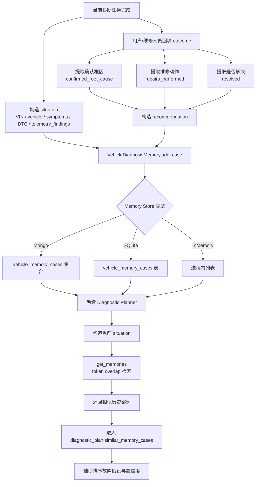
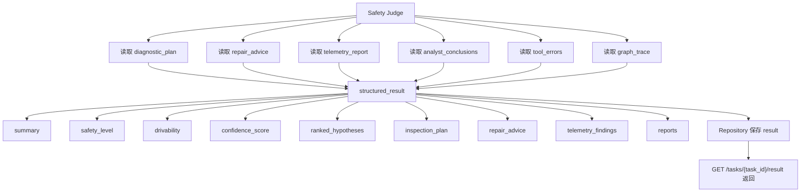

# 车辆故障诊断 Agent 流程图

> Mermaid 流程图，可在 GitHub、VSCode Markdown Preview、Typora 等支持 Mermaid 的工具中直接渲染。

## 1. 端到端主流程

## 2. LangGraph Agent 诊断流程

## 3. 工具调用与 Fallback 流程

## 4. 数据源 Fallback 流程

## 5. Memory 读写闭环

## 6. 最终结果结构

